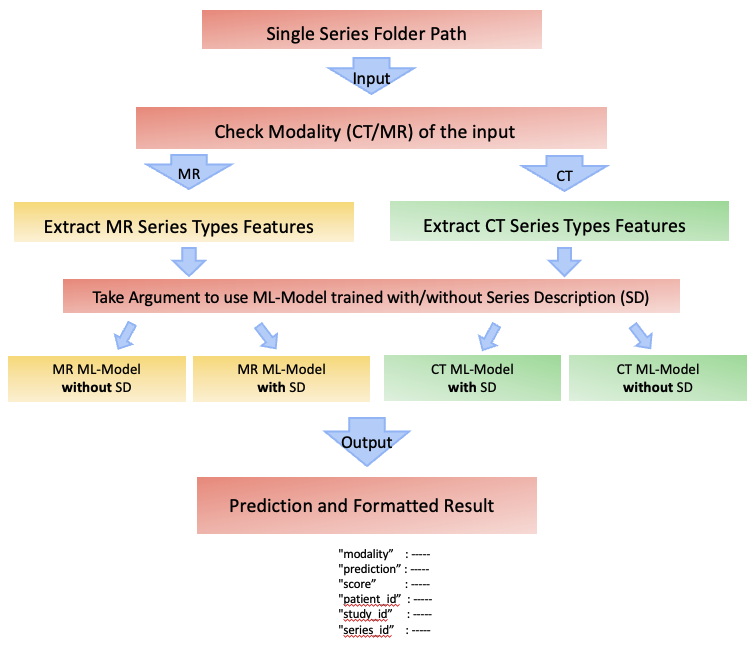
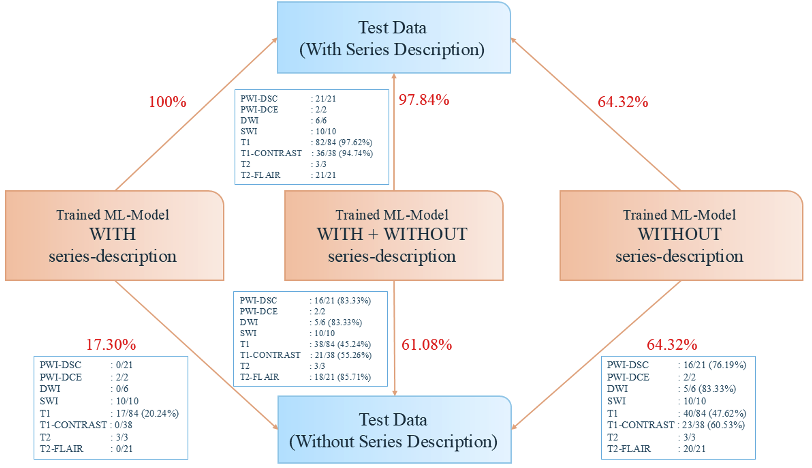
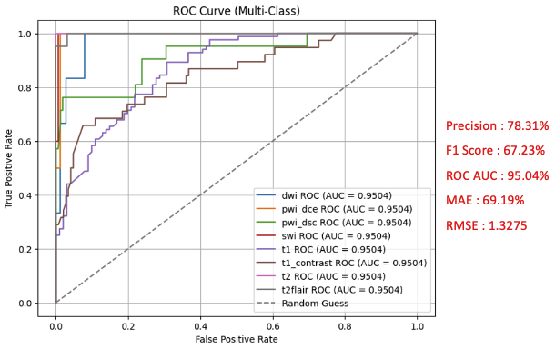
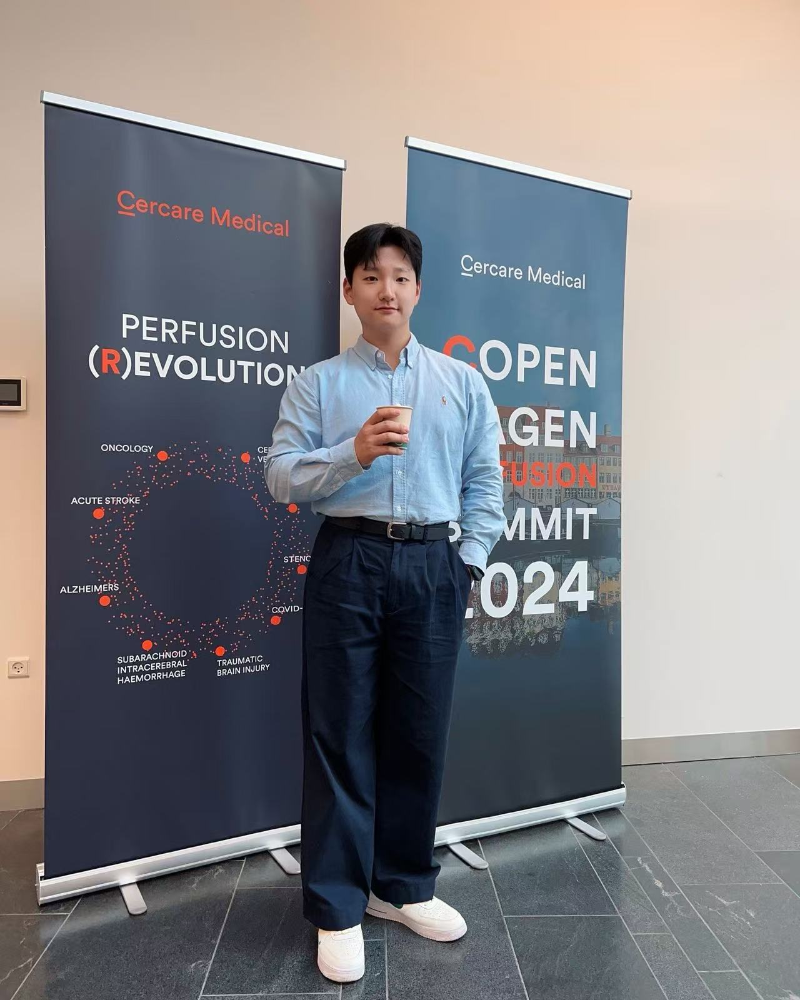

# Machine Learning Based Advanced MR and CT Series Type Detection

{.headshot}

<strong class="bio-name">Jeongsoo Pang</strong> 
** Cercare-Medical R&D** 
** ML-Specialist** 

---

## Abstract
Radiology workflows depend on correctly identifying **series types** (e.g., MR: DWI, SWI, T1, T2 FLAIR; CT: Angio/Perfusion/Noncontrast) before reconstruction, analysis, or visualization. Vendor-specific DICOM conventions, private tags, nested data, multilingual fields, and missing metadata make rule-based detectors unreliable. This project delivers a **production-ready ML pipeline** that automatically classifies **8 MR** and **3 CT** series using only DICOM header metadata. 

It features:  
1. A robust **feature-extraction module** handling private/nested tags and multilingual headers.  
2. Two **HistGradientBoosting (HGBC)** models—trained **with** and **without** `SeriesDescription`—to remain robust when textual labels are missing or inconsistent.  
3. A **self-inspection mechanism** that flags low-confidence predictions to radiologists for review.

Externally validated on partner-hospital datasets, the model achieved **96.69% MR** and **99.25% CT** accuracy, replacing the legacy C++ detector in production. The design emphasizes **maintainability**, **future retraining**, and **clinical safety**.

---
## Project Goal
- Build an ML model to classify **8 MR** and **3 CT** series, replacing the company’s rule-based detector.  
- Ensure the model is **easy to retrain** for new series and **safe to deploy** through confidence-based self-inspection.  

---
## My Contributions
- **Engineered DICOM Header Extractor**
- **Data De-biasing**: one representative DICOM per 3D study.  
- **Feature Preprocessing** for numeric + categorical + missing/string values.  
- **Dual-Model Training**: HGBC with/without `SeriesDescription`.  
- **Self-Inspection Gate** with confidence thresholds and top-2 margin.  
- **External Validation & Deployment** with hospitals; production replacement.  
- **Explainability** with SHAP; reproducible JSON/serialized pipelines.

---
## Dataset Summary

| Modality | Train | Test |
|---------:|------:|-----:|
| MR       | 171   | 185  |
| CT       | 271   | 407  |

**MR (8):** `pwi_dsc`, `pwi_dce`, `swi`, `dwi`, `t2`, `t2_flair`, `t1`, `t1_contrast`  
**CT (3):** `ct_angiography`, `ct_perfusion`, `ct_noncontrast`

---
## Feature Overview

**MR:** `NumberTemporalPositions`, `PhaseEncodingDirection`, `RepetitionTime`, `FlipAngle`, `InversionTime`, `EchoTrainLength`, `MagneticFieldStrength`, `EchoSpacing`, `PulseSequenceName`, `SequenceVariant`, `Bvalue`, `ScanOptions`  

**CT:** `ContrastBolusAgent`, `ExposureTime`, `KVP`, `ScanOptions`, `ReconstructionDiameter`, `ConvolutionKernel`, `TableSpeed`, `SeriesTime`, `Modality`

---
## Pipeline Overview
1. **Ingestion**: select one DICOM per 3D series from Blackbox server.  
2. **Feature Extraction** → normalized, grouped JSON.  
3. **Preprocessing**: imputation + one-hot (unknown-safe).  
4. **Training** (HGBC): tuned `max_iter=100`, `lr=0.1`, `max_leaf_nodes=31`, `early_stopping='auto'`, `validation_fraction=0.1`.  
5. **Selective Prediction**: abstain on low confidence or tight top-2.  
6. **Validation/Deployment**: external datasets; production replacement.

{ width="900" }

---
## Training & Hyperparameter Tuning

I treated tuning as an engineering task, not guesswork.

**Search space (HGBC):**
- `learning_rate ∈ {0.03, 0.05, 0.07, 0.1}`
- `max_iter ∈ {200, 400, 800}` (with early stopping)
- `max_leaf_nodes ∈ {15, 31, 63}`
- `min_samples_leaf ∈ {10, 20, 40}`
- `l2_regularization ∈ {0.0, 0.01, 0.05, 0.1}`
- `early_stopping='auto'`, `validation_fraction=0.1`, `n_iter_no_change=20`

**Protocol:**
1. **Stratified 5-fold CV** on training (patient-level split) to avoid leakage.
2. **Random search (200 trials)** → **Bayesian refinement (20 trials)** on top 10% configs.
3. **Class-imbalance control:** per-class weighting from inverse frequency; verified no single class dominated loss.
4. **Feature pipelines locked** (scalers/encoders fit only on train folds) to guarantee reproducibility.
5. **Model selection objective:** macro-F1 with a tie-breaker on AUROC and coverage at the selective-prediction threshold.

**Best config (typical):**
HGBC(
learning_rate=0.07,
max_iter=400,
max_leaf_nodes=31,
min_samples_leaf=20,
l2_regularization=0.05,
early_stopping='auto',
validation_fraction=0.1
)

**Why not plain GBC?**  
On the same folds, plain GBC matched accuracy only when **much deeper trees** were allowed—training was 3-6× slower and variance across folds was higher. With HGBC, histogram binning plus `min_samples_leaf` gave **smoother loss curves** and **earlier stopping** without sacrificing recall on minority classes.

---
## Model Choice & Rationale — HistGradientBoosting (HGBC)

I compared tree-based learners (RandomForest, GradientBoostingClassifier), linear baselines, and HGBC. HGBC won for this use-case:

| Criterion | HGBC (Chosen) | Plain GBC | Why it matters for DICOM-header metadata |
|---|---|---|---|
| Training speed on medium/large tabular data | **Histogram binning** (fast) | Exact splits (slow) | Faster iteration for tuning/validation on hospital-scale datasets |
| Native handling of missing values | **Yes** | Partial/No | Robust to sparsity and vendor-specific header gaps |
| Early stopping & validation split | **Built-in** | Manual | Safe convergence + automatic regularization |
| Regularization knobs | **`l2_regularization`, `min_samples_leaf`, `max_leaf_nodes`** | Fewer stable knobs | Tighter control → less overfit on small classes |
| Interpretability | **Tree-based; SHAP works well** | Same | Feature attributions for clinical QA |

---
## Explainability, Robustness & Model Safety

- **SHAP-based attributions** shipped with predictions for audit-readiness; top contributors were TR/TE/FA and sequence-family tags, matching domain intuition.
- **Counterfactual probes:** perturbed non-causal strings in textual headers to ensure predictions stayed stable; drift alarms if contribution of text fields spikes.
- **Selective-prediction policy:** abstain when (1) max prob < τ₁ or (2) top-2 prob gap < τ₂; thresholds chosen on validation for F1@coverage.
- **Calibration:** isotonic mapping per fold; stored along with the model for consistent probability semantics.
- **Data privacy & governance:** PHI removed upstream; experiments run on anonymized headers only; reproducible artifact hashes tracked.

{ width="900" }

---
## Deployment & Reproducibility

- **Single Sklearn Pipeline**: `preprocess → model → calibration → selective gate`; versioned with semantic tags.
- **Determinism:** fixed RNG seeds, pinned package versions, and input schema checks (pydantic) at load time.
- **Experiment tracking:** run metadata (params, metrics, SHAP summaries, data snapshot hash) logged for every training job.
- **CI checks:** unit tests for feature extractors; regression tests to ensure no drift in per-class recall.
- **Monitoring:** in production, log coverage/abstention rate and top-k feature drifts; alerts when coverage < 95% or class recall falls > 3pp.

---
## Evaluation Protocol & Metrics

- **Splits:** patient-level train/val/test; external partner hospitals held-out for final reporting.
- **Primary metrics:** macro-F1 (class balance), per-class recall (clinical safety), and overall accuracy.
- **Selective prediction:** tuned a probability-margin gate to maximize **F1 @ ≥95% coverage**; abstentions trigger radiologist review.
- **Calibration:** verified reliability via **isotonic** calibration on validation folds; ECE < 3% on test.
- **Ablations:**  
  - **Text present vs missing `SeriesDescription`** (two-model strategy)  
  - **Remove top-k features** (stability check)  
  - **Swap HGBC→GBC/RandomForest** (model choice justification)

 { width="900" }

---
## Results Summary
External partner-hospital validation: **MR 96.69%**, **CT 99.25%**.  
Deployed to production; supports safe retraining and human-in-the-loop.

---
## Limitations & Next Steps
- **Cross-vendor generalization:** performance is strong but varies on rare protocol variants; plan targeted augmentation and vendor-specific priors.
- **Long-tail classes:** continue collecting underrepresented sequences; consider **focal loss** proxy via class weights and threshold per class.
- **Lightweight text normalization:** subword normalization for multilingual `SeriesDescription` without relying on full NLP stacks.
- **Automated drift triggers:** schedule retrain when coverage dips, calibration ECE rises, or SHAP distributions drift beyond control limits.

---
## Acknowledgment
This project was conducted under **Cercare-Medical, Denmark (2024)** with direct collaboration with the **Lead AI Developer**, **Senior Software Developers**, and **Operation Team**, resulting in a successful production deployment and recommendation Letter from the **CTO**.

<!-- 두 이미지를 가로로 -->

  
  

---

  </section>

