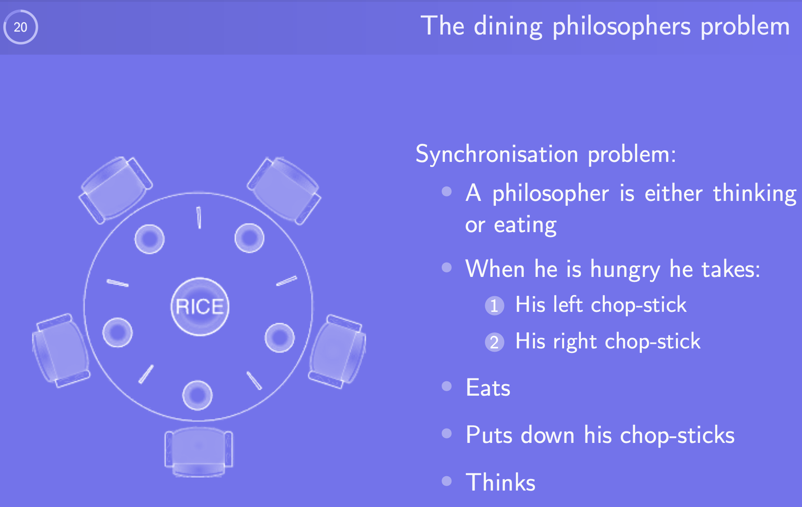
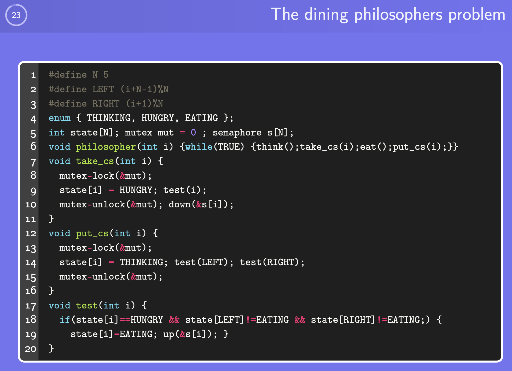

# Scheduling  
---

## **Scheduler’s Role**
- Multiple processes competing for CPU time
- When more than one is Ready, scheduler chooses who runs next
- Affects perceived system performance
- Scheduling decisions occur on: Process creation, Process exit / blocking, or I/O completion interrupt

---

## **Context Switch Overhead**
Switching tasks is expensive:

- Trap to kernel mode
- Save current CPU state (registers, memory map)
- Select new process & restore its state
- Resume execution  
Too many switches waste CPU time.

---

## **Process CPU Behavior**
Two typical categories:

| Type | Behavior | Resource Usage | Notes |
|---|---|---|---|
| **CPU-bound** | Long computations | Mostly CPU | Few I/O wait times |
| **I/O-bound** | Short bursts | Mostly I/O | Spend time waiting |

> Modern systems become more I/O-bound as CPUs get faster.

---

## **Preemptive vs Non-Preemptive Scheduling**

| Strategy | CPU Ownership Ends When… | Pros | Cons |
|---|---|---|---|
| **Preemptive** | Quantum expires or higher-priority arrival | Better for interactivity | More context switch overhead |
| **Non-Preemptive** | Process blocks or exits | Simpler, lower overhead | Bad response time if long jobs exist |

> Preemption requires timer interrupt/hardware support.

---

## **Scheduling Goals**

| System Type | Major Metrics |
|---|---|
| **All systems** | Fairness, CPU balance, enforce policy |
| **Interactive** | Response time, proportionality |
| **Batch** | Throughput ↑, turnaround time ↓, CPU utilization ↑ |
| **Real-Time** | Meet deadlines, predictability (NO data loss) |  


---

## **Common Scheduling Algorithms**

### **1. First-Come First-Served (FCFS)**
- Non-preemptive
- Simple FIFO queue 
Problem: Long jobs block short ones (convoy effect)

---

### **2. Shortest Job First (SJF)**
- Non-preemptive, requires job length knowledge
- Minimizes average turnaround time
- Not realistic → runtime unknown  
Risk: Starvation of long jobs

---

### **3. Round Robin (RR)**
- Preemptive, equal quantum for each process
- Very common in interactive systems
- Choice of quantum matters:
  - Too small → context switching overhead ↑
  - Too large → degenerates to FCFS

---

### **4. Priority Scheduling**
- Higher priority tasks run first
- Can combine with RR per priority class
- Starvation possible → fix: aging

---

### **5. Lottery Scheduling**
- Random scheduling based on # of tickets
- Dynamic, flexible priority control  
- Good when fairness with weighted share is desired

---

### **6. Earliest Deadline First (EDF)**
- Real-time focused
- Run task with closest deadline first
Hard requirement: process must announce deadline

---

## **Policy vs. Mechanism**
- **Scheduling mechanism**: how scheduling is done
- **Scheduling policy**: who should run + priority rules
- Parent process can set children priority parameters → avoids assumptions  

---

## **Scheduling Threads**
User-level vs Kernel-level scheduling  

- User level threads: Kernel unaware → user scheduler only
- Kernellevel threads: Kernel actively chooses runnable threads
- Determines runnable interleavings (A1, B1, A2, …)
---

## **Classic Synchronization Problem: Dining Philosophers**
Illustrates deadlock + starvation risks

{ width="500" }

- Five philosophers share chopsticks
- Need mutual exclusion on chopsticks
  
{ width="500" }

### Problem Recap
- Deadlock : All philosophers pick the left chopstick and wait forever
- Starvation : A philosopher may never get a chance to eat
- Concurrency control : Neighbors must not eat simultaneously

### Key Ideas
| Component                          | Purpose                                               | Effect                                         |
| ---------------------------------- | ----------------------------------------------------- | ---------------------------------------------- |
| `state[i]`                         | Each philosopher’s state (THINKING / HUNGRY / EATING) | Allows control logic on neighbors              |
| `mut` (mutex)                      | Protects access to shared state                       | Ensures mutual exclusion when modifying states |
| `s[i]` (semaphore per philosopher) | Controls who gets permission to eat                   | Prevents neighbors from eating simultaneously  |
| `test(i)`                          | Check if philosopher `i` can start eating             | Enforces safe conditions                       |

### Execution Flow
#### When Philosopher Gets Hungry → `take_cs(i)`
1. Lock mutex
2. Set state to `HUNGRY`
3. Check if neighbors are eating (`test(i)`)
4. Unlock mutex
5. Wait until permission is given (`down(s[i])`) → Blocks until chopsticks available

#### After Eating → `put_cs(i)`
1. Lock mutex
2. Set state back to `THINKING`
3. Signal neighbors to try eating (`test(LEFT)` + `test(RIGHT)`)
4. Unlock mutex

### The Heart of the Solution → `test(i)`
```c
if (state[i] == HUNGRY &&
    state[LEFT] != EATING &&
    state[RIGHT] != EATING) {
    state[i] = EATING;
    up(&s[i]);
}
```
This guarantees:

- A philosopher only eats if both neighbors are not eating
- Unlocks semaphore for only one philosopher at a time

### How It Solves the Classical Issues
| Issue                               | How It is Prevented                                                                                                    |
| ----------------------------------- | ---------------------------------------------------------------------------------------------------------------------- |
| **Deadlock**                        | No circular wait: philosopher only grabs both chopsticks when allowed; otherwise releases/not blocks while holding one |
| **Starvation**                      | When a philosopher stops eating, neighbors are **immediately tested and possibly signaled → fairness                 |
| **Race conditions on state**        | Protected by mutex (`mut`)                                                                                             |
| **Neighbors eating simultaneously** | `test()` explicitly checks left & right philosopher states                                                             |

